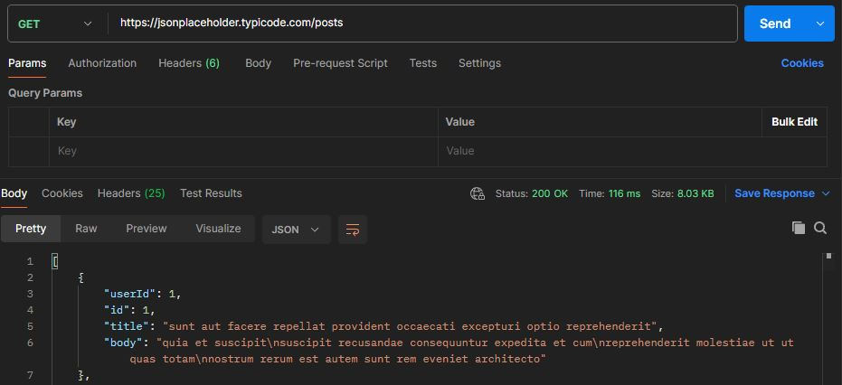
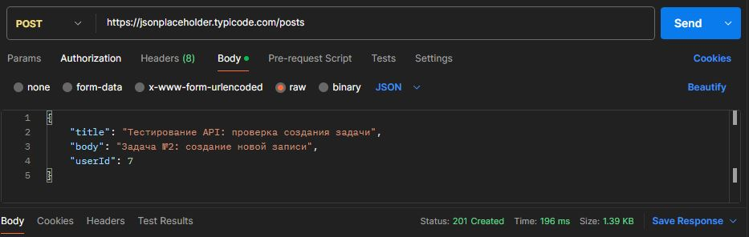

# Портфолио по тестированию

Проект: **SauceDemo** (учебный интернет-магазин)

Содержание:
- Чек-лист авторизации
- 3 тест-кейса
- Баг-репорт со скриншотами

# Чек-лист: авторизация на SauceDemo

| № | Проверка | Логин | Пароль | Ожидание | Результат |
|---|----------|-------|--------|----------|-----------|
| 1 | Успешный вход (standard_user) | standard_user | secret_sauce | редирект на /inventory.html | ОК |
| 2 | Успешный вход (problem_user) | problem_user | secret_sauce | редирект на /inventory.html | ОК |
| 3 | Успешный вход (performance_glitch_user) | performance_glitch_user | secret_sauce | редирект на /inventory.html | ОК |
| 4 | Пустой логин | (пусто) | secret_sauce | Epic sadface: Username is required | ОК |
| 5 | Пустой пароль | standard_user | (пусто) | Epic sadface: Password is required | ОК |
| 6 | Оба поля пустые | (пусто) | (пусто) | Epic sadface: Username is required | ОК |
| 7 | Неверный логин | fake_user | secret_sauce | Epic sadface: Username and password do not match any user in this service | ОК |
| 8 | Неверный пароль | standard_user | fake_pass | Epic sadface: Username and password do not match any user in this service | ОК |

---

# Тест-кейсы: авторизация на SauceDemo

**TC-01 – Успешная авторизация с корректным пользователем**

**Предусловия:** открыта страница https://www.saucedemo.com/

**Шаги:**
1. В поле Username ввести `standard_user`
2. В поле Password ввести `secret_sauce`
3. Нажать кнопку Login

**Ожидаемый результат:** Открывается страница https://www.saucedemo.com/inventory.html

---

**TC-02 – Пустой логин**

**Предусловия:** открыта страница https://www.saucedemo.com/

**Шаги:**
1. Поле Username оставить пустым
2. В поле Password ввести `secret_sauce`
3. Нажать кнопку Login

**Ожидаемый результат:** Появляется сообщение об ошибке `Epic sadface: Username is required`

---

**TC-03 – Неверный пароль**

**Предусловия:** открыта страница https://www.saucedemo.com/

**Шаги:**
1. В поле Username ввести `standard_user`
2. В поле Password ввести `fake_pass`
3. Нажать кнопку Login

**Ожидаемый результат:** Появляется сообщение об ошибке `Epic sadface: Username and password do not match any user in this service`

---

# Баг-репорт

**BUG_001**

**Заголовок:** Главная страница: У пользователя problem_user у всех товаров одинаковые изображения

**Шаги воспроизведения:**
1. Зайти на https://www.saucedemo.com/
2. Войти под логином problem_user / пароль secret_sauce
3. Посмотреть на изображения товаров

**Фактический результат:** У всех товаров изображение с собакой (одинаковое)

**Ожидаемый результат:** У каждого товара свое уникальное изображение

**Логи (Console DevTools):**
- `inventory.html:1 Failed to load resource: the server responded with a status of 404 ()`

**Скриншоты:**


### SQL запрос (авиаперелёты)

**Задача:**  
Вывести рейсы дороже 1000: номер рейса, город вылета, город прилёта, производителя и модель самолёта.

**Запрос:**

```text
SELECT 
    f.flight_number, 
    adp.city AS departure_city, 
    ads.city AS destination_city, 
    a.manufacturer, 
    a.model
FROM flight f
JOIN airport adp ON f.departure_airport_airport_id = adp.airport_id
JOIN airport ads ON f.destination_airport_airport_id = ads.airport_id
JOIN aircraft a ON a.aircraft_id = f.aircraft_aircraft_id
WHERE f.flight_charge > 1000
ORDER BY f.flight_charge DESC;

---
### API тестирование (Postman)

Тестируемое API: [JSONPlaceholder](https://jsonplaceholder.typicode.com/)

**GET-запрос** — получение списка постов:



**POST-запрос** — создание нового поста:


