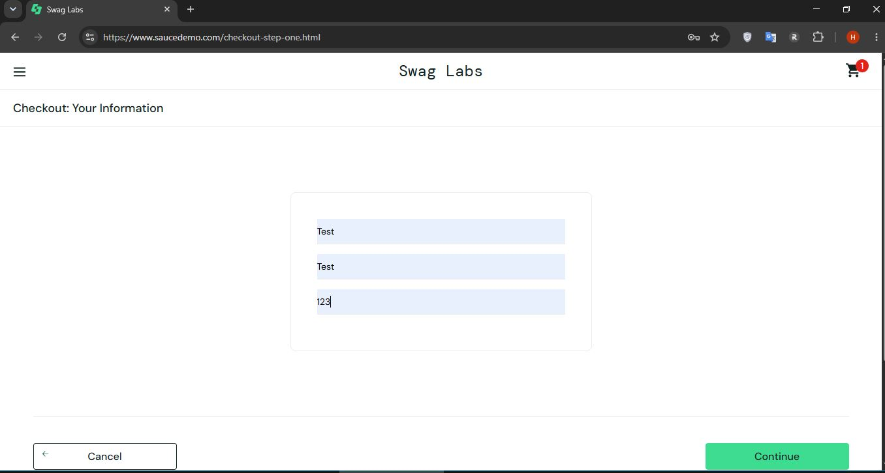

# Портфолио по тестированию
**Меня зовут Наталья.** Я начинающий тестировщик.  
Представляю свои учебные проекты для демонстрации навыков.

## 📌 Оглавление
0. Мой опыт как основа для тестирования
1. Функциональное тестирование (SauceDemo)
2. Работа с SQL (FTB)
3. Тестирование API (JSONPlaceholder)

## 0. 🎯 Мой опыт как основа для тестирования

До перехода в QA я 10+ лет работала с данными и процессами. Это дало мне:

**UAT и аналитика:**
- Участвовала во внедрении в SAP CRM функции автоматизации оплат: совместно с коллегами обосновывала ROI (анализ данных, расчет рисков), готовила ТЗ, приоритизировала задачи.
- Проводила UAT: проверяла сценарии, выявляла несоответствия, контролировала исправления.
- Результат: функция внедрена, ручной труд и финансовые риски сокращены.

**Работа с данными и багами:**
- Ежемесячно и ежеквартально анализировала оплаты 30+ филиалов, сверяла SAP CRM с первичной документацией.
- Классифицировала ошибки (критичные/некритичные), координировала исправления.
Итог: снижение просрочек на 30%, внедрение регламента работы с филиалами.
- Дополнительно: анализ тендерной документации (выявление условий → выигрыш 3 тендеров на 5+ млн руб.), контроль выплатных дел (сокращение срока выплат с 60 до 20 дней).

**Почему это важно для QA:**  
Я уже умею находить несоответствия, приоритизировать баги, работать с ТЗ и бизнесом — переношу эти навыки на тестирование ПО.

## 1. 🧪 Функциональное тестирование (SauceDemo — интернет-магазин (учебный))

### 📋 Чек-лист авторизации

| № | Проверка | Логин | Пароль | Ожидание | Результат |
|---|----------|-------|--------|----------|-----------|
| 1 | Успешный вход | standard_user | secret_sauce | редирект на /inventory.html | ОК |
| 2 | Пустой логин | (пусто) | secret_sauce | Epic sadface: Username is required | ОК |
| 3 | Пустой пароль | standard_user | (пусто) | Epic sadface: Password is required | ОК |
| 4 | Оба поля пустые | (пусто) | (пусто) | Epic sadface: Username is required | ОК |
| 5 | Неверный логин | fake_user | secret_sauce | Epic sadface: Username and password do not match any user in this service | ОК |
| 6 | Неверный пароль | standard_user | fake_pass | Epic sadface: Username and password do not match any user in this service | ОК |

---

### 🧾 Тест-кейс

**TC-01 – Проверка валидации поля Zip/Postal Code при оформлении заказа**

**Priority:** High

**Предусловия:** Открыта страница авторизации `https://www.saucedemo.com/`

**Шаги:**
1. Авторизоваться как `standard_user` / `secret_sauce`
2. Добавить любой товар в корзину
3. Перейти в корзину и нажать **Checkout**
4. На шаге `Checkout: Your Information` заполнить поля:
   - First Name: `Test`
   - Last Name: `Test`
   - Zip/Postal Code: `123`
5. Нажать кнопку **Continue**

**Ожидаемый результат:**
Система не переходит на следующий шаг. Отображается сообщение об ошибке (текст может быть любым).

---

### 🐞 Баг-репорт 

#### BUG_001: Невалидный почтовый индекс не блокирует оформление заказа

**Окружение:**
- OS: Windows 10
- Браузер: Google Chrome, версия: 148.0.7778.218

**Priority:** Medium
**Severity:** Minor

**Заголовок:** Страница оформления заказа: Поле "Zip/Postal Code" принимает невалидный индекс и позволяет продолжить оформление.

**Шаги воспроизведения:**
1. Авторизоваться на https://www.saucedemo.com/ как `standard_user` / `secret_sauce`
2. Добавить любой товар в корзину
3. Перейти в корзину и нажать **Checkout**
4. На шаге `Checkout: Your Information` заполнить поля:
   - First Name: `Test`
   - Last Name: `Test`
   - Zip/Postal Code: `123` (заведомо невалидный индекс)
5. Нажать кнопку **Continue**

**Фактический результат:**  
Система не проверяет формат почтового индекса и переходит на следующий шаг оформления заказа (`Checkout: Overview`).

**Ожидаемый результат:**  
Система проверяет введенный почтовый индекс на соответствие формату. При вводе невалидного значения должно отображаться сообщение об ошибке (например, *"Please enter a valid postal code"*), и пользователь не должен переходить к следующему шагу.

**Обоснование:**  
Поле почтового индекса является критическим для расчета доставки. Отсутствие его валидации противоречит общепринятой практике для e-commerce сайтов.

**Скриншот:**




## 2. 🗄️ Работа с SQL (FTB)

**Запрос 1 (базовый):** Рейсы дороже 1000

```sql
SELECT 
    f.flight_number, 
    adp.city AS departure_city, 
    ads.city AS destination_city, 
    a.manufacturer, 
    a.model
FROM flight f
JOIN airport adp ON f.departure_airport_airport_id = adp.airport_id
JOIN airport ads ON f.destination_airport_airport_id = ads.airport_id
JOIN aircraft a ON a.aircraft_id = f.aircraft_aircraft_id
WHERE f.flight_charge > 1000
ORDER BY f.flight_charge DESC;
```

**Запрос 2 (агрегация):** Модели самолётов со средней ценой > 1500

```sql
SELECT 
    a.model, 
    AVG(f.flight_charge) AS avg_charge, 
    COUNT(f.flight_id) AS total_flights
FROM flight f 
JOIN aircraft a ON f.aircraft_aircraft_id = a.aircraft_id
GROUP BY a.model
HAVING AVG(f.flight_charge) > 1500
ORDER BY avg_charge DESC;
```

## 3. 📬 Тестирование API (JSONPlaceholder)

Тестируемое API: [JSONPlaceholder](https://jsonplaceholder.typicode.com/)

### GET /posts
- **URL:** https://jsonplaceholder.typicode.com/posts
- **Ожидаемый статус:** 200 OK
- **Фактический статус:** 200 ✅


### POST /posts
- **URL:** https://jsonplaceholder.typicode.com/posts
- **Тело запроса:**

```json
{
    "title": "Тестирование API: проверка создания задачи",
    "body": "Задача №2: создание новой записи",
    "userId": 7
}
```

- **Ожидаемый статус:** 201 Created
- **Фактический статус:** 201 ✅


